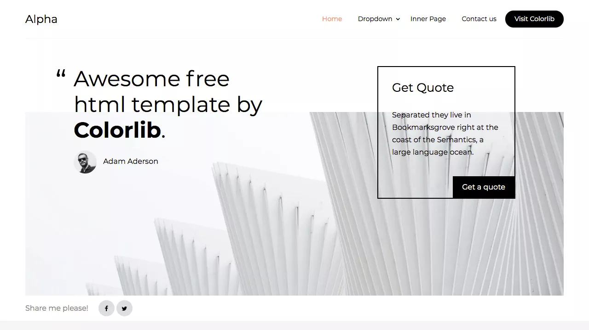
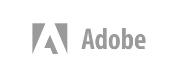

# clone_colorlib
# screenshot of the colorlib wesite

# HTML code
<!DOCTYPE html>
<html lang="en">
<head>
    <meta charset="UTF-8">
    <meta name="viewport" content="width=device-width, initial-scale=1.0">
    <link rel="stylesheet" href="style.css">
    
    <title>Document</title>
</head>
<body>
    <header class="header">
        <nav class="navbar">
          
Bold.

          <ul class="nav-links">
            <li><a href="#">Home</a></li>
            <li class="dropdown">
              <a href="#">Dropdown</a>
              

                <a href="#">one</a>
                <a href="#">two</a>
                <a href="#">three</a>
              

            </li>
            <li><a href="#">Inner Page</a></li>
            <li><a href="#">Contact us</a></li>
            <li><a href="#">Free Templates</a></li>
          </ul>
        </nav>
      </header>
      <section class="hero-section">
        <h1>Another cool free template by the fine folks at Colorlib</h1>
        
Far far away, behind the word mountains, far from the countries Vokalia and Consonantia, there live.

        <i class="fa-sharp fa-solid fa-circle-play"></i>
        
      </section>
    </body>
    </html>
    <section class="achievements-section">
        <h2>Our Achievements</h2>
        

          

            <h3>4M+</h3>
            
Members

          

          

            <h3>3K+</h3>
            
Likes

          

          

            <h3>20K+</h3>
            
Shares

          

        

      </section>
      <section class="brands-section">
        <h2 class="head1">Leading brands trust Bold for good</h2>
        

          
          
          
          
          
        

      </section>
    <section class="description-section">
        

          

            <h2>Far far away, behind the word mountains</h2>
            
Far far away, behind the word mountains, far from the countries Vokalia and Consonantia, there live.

          

          

            <h2>Far far away, behind the word mountains</h2>
            
Far far away, behind the word mountains, far from the countries Vokalia and Consonantia, there live.

          

          

            <h2>Learn more</h2>
            
Far far away, behind the word mountains, far from the countries Vokalia and Consonantia, there live.

          

        

      </section>
    <section class="testimonial-section">
        
        

          <blockquote>
            “Far far away, behind the word mountains, far from the countries Vokalia and Consonantia, there live the blind texts. Separated they live in Bookmarksgrove right at the coast of the Semantics, a large language ocean. A small river named Duden flows by their place and supplies it with the necessary regelialia. It is a paradisematic country.“
          </blockquote>
          
Kayla Bryant Social Media Manager, Digital App

        

      </section>
    <section class="join-section">
        <h2>Join over 1M+ people who enjoy using our app</h2>
        

          
          
          
          
        

        <form class="join-form">
          <input type="text" placeholder="First name">
          <input type="email" placeholder="Your Email">
          <input type="text" placeholder="Company">
          <select>
            <option value="small">Small</option>
            <option value="medium">Medium</option>
            <option value="large">Large</option>
          </select>
          <textarea placeholder="Write something..."></textarea>
          <button type="Send">Send form</button>
        </form>
      </section>
    <footer class="footer">
        

          

            <h2>About</h2>
            
Far far away, behind the word mountains, far from the countries Vokalia and Consonantia, there live the blind texts.

          

          

            <h2>Solutions</h2>
            <ul>
              <li>Studio</li>
              <li>Creative</li>
              <li>Design</li>
              <!-- Add more items as needed -->
            </ul>
          

          

            <h2>Resources</h2>
            <ul>
              <li>Blog</li>
              <li>Customers</li>
              <li>Video Showcase</li>
              <li>Watch a Demo</li>
              <!-- Add more items as needed -->
            </ul>
          

          

            <h2>Company</h2>
            <ul>
              <li>About Us</li>
              <li>Jobs</li>
              <li>Press</li>
            </ul>
          

        

        

          
&copy; 2023 All rights reserved | This template is made with &#x2764; by Uday kumar

          
Terms & Conditions | Privacy Policy

        

      </footer>
</body>
</html>

# CSS code
* {
	margin: 0;
	padding: 0;
	box-sizing: border-box;
  }
  .header {
	background-color: #333;
	color: white;
	padding: 1rem 0;
  }
  
  .navbar {
	max-width: 1200px;
	margin: 0 auto;
	display: flex;
	justify-content: space-between;
	align-items: center;
  }
  
  .logo {
	font-size: 1.5rem;
	font-weight: bold;
  }
  
  .nav-links {
	list-style: none;
	display: flex;
	align-items: center;
  }
  
  .nav-links li {
	margin-right: 1.5rem;
  }
  
  .nav-links a {
	color: white;
	text-decoration: none;
  }
  
  .dropdown {
	position: relative;
  }
  
  .dropdown-content {
	position: absolute;
	top: 100%;
	left: 0;
	background-color: #f9f9f9;
	display: none;
  }
  
  .dropdown:hover .dropdown-content {
	display: block;
  }
  
  .hero-section {
	background-color: #ff926b;
	text-align: center;
	justify-content: center;
	padding: 5rem 0;
	width: 100%;
	height:500px;
  }
  
  .hero-section h1 {
	font-size: 2rem;
	margin-bottom: 1rem;
  }
  
  .hero-section p {
	font-size: 1rem;
	color: #2e2727;
  }
  .intro{
	margin: 30px;
	width: 80%;
	height: 400px;
  }
  .achievements-section {
  background-color: #fff;
  padding: 3rem 0;
  text-align: center;
}

.achievements-section h2 {
  font-size: 1.8rem;
  margin-bottom: 2rem;
}

.achievements {
  display: flex;
  justify-content: center;
  gap: 2rem;
}

.achievement {
  flex: 1;
  padding: 1rem;
  border: 1px solid #ccc;
  border-radius: 4px;
  background-color: #f9f9f9;
}

.achievement h3 {
  font-size: 1.5rem;
  margin-bottom: 0.5rem;
}
  .head1{
	text-align: center;

  }
  .brands-section h2 {
	font-size: 1.8rem;
	margin-bottom: 2rem;
  }
  
  .brand-images {
	display: flex;
	justify-content: center;
	gap: 1rem;
	margin-top: 1.5rem;
  }
  
  .brand-images img {
	max-width: 100px;
  }
  
  .description-section {
	background-color: #f5f5f5;
	padding: 3rem 0;
	text-align: center;
  }
  
  .description-content {
	max-width: 800px;
	margin: 0 auto;
  }
  
  .description-item {
	margin-bottom: 2rem;
  }
  
  .description-item h2 {
	font-size: 1.5rem;
	margin-bottom: 1rem;
  }
  
  .testimonial-section {
	display: flex;
	justify-content: space-between;
	align-items: center;
	background-color: #f5f5f5;
	padding: 2rem;
  }
  
  .testimonial-content {
	max-width: 600px;
	margin: 0 auto;
	text-align: center;
  }
  .imgbig{
	max-width: 50%;
	max-height: 50%;
  }
  
  blockquote {
	font-size: 1.2rem;
	margin-bottom: 1rem;
  }
  
  .author {
	font-size: 0.9rem;
	color: #555;
  }
  .join-section {
	display: flex;
	text-align: center;
	justify-content: space-between;
	padding: 2rem;
  }
  
  .join-section h2 {
	font-size: 1.5rem;
	margin-bottom: 1.5rem;
  }
  
  .images {
	justify-content: center;
	gap: 1rem;
	margin-bottom: 1.5rem;
  }
  
  .images img {
	max-width: 30px;
	max-height: 30px;
  }
  
  .join-form {
	max-width: 400px;
	margin: 0 auto;
  }
  
  .join-form input,
  .join-form select,
  .join-form textarea {
	width: 100%;
	padding: 0.5rem;
	margin-bottom: 1rem;
	border: 1px solid #ccc;
	border-radius: 4px;
  }
  
  .join-form button {
	background-color: #333;
	color: white;
	padding: 0.5rem 1rem;
	border: none;
	border-radius: 4px;
	cursor: pointer;
	font-weight: bold;
  }
  
  /* Basic styling for the footer */
  .footer {
	background-color: #333;
	color: white;
	padding: 2rem 0;
  }
  
  .footer-content {
	max-width: 1200px;
	margin: 0 auto;
	display: flex;
	justify-content: space-between;
	flex-wrap: wrap;
  }
  
  .footer-section {
	flex: 1;
	margin: 0 1rem;
  }
  
  .footer h2 {
	font-size: 1.5rem;
	margin-bottom: 1rem;
  }
  
  .footer p {
	font-size: 14px;
	line-height: 1.5;
  }
  
  .footer ul {
	list-style: none;
	padding: 0;
  }
  
  .footer ul li {
	margin-bottom: 0.5rem;
  }
  
  .footer-bottom {
	margin-top: 1.5rem;
	text-align: center;
  }
  
  .footer-bottom p {
	font-size: 12px;
  }
  
  /* Styling for links if needed */
  .footer a {
	color: white;
	text-decoration: none;
  }

